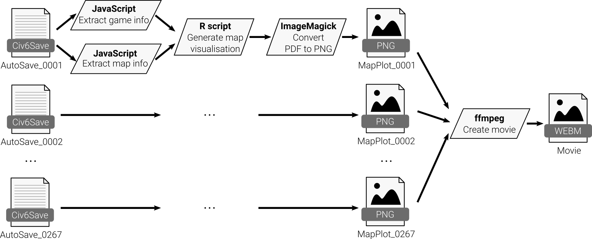
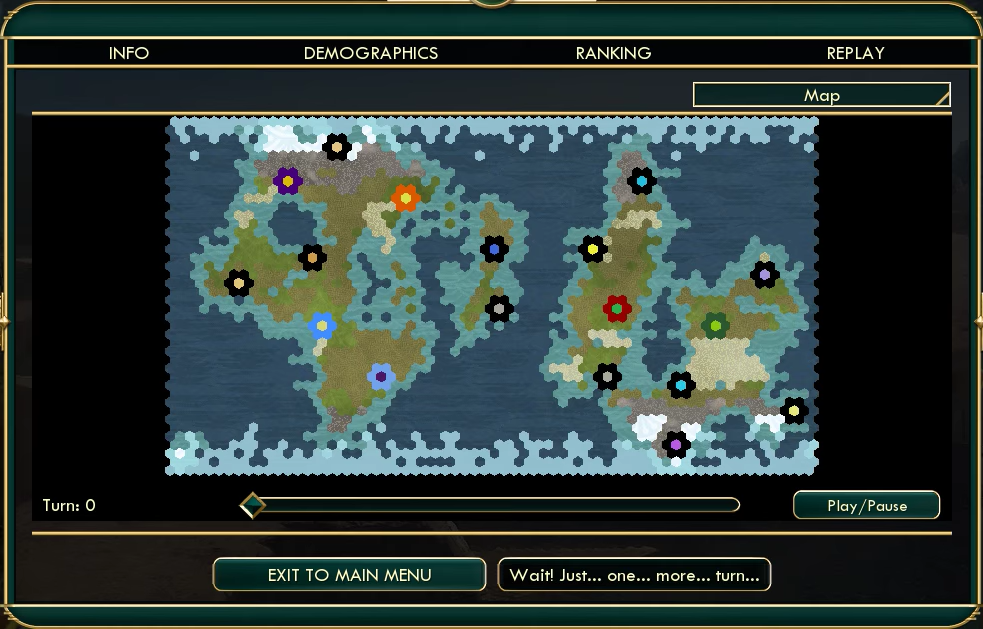
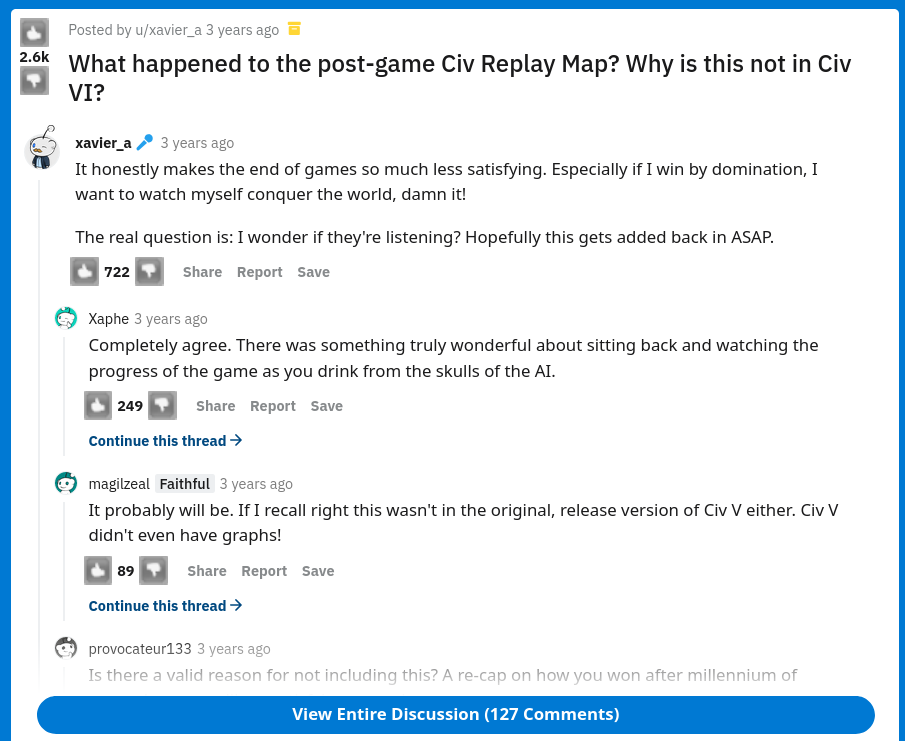

-   [Civ6 post-game summary](#civ6-post-game-summary)
    -   [Run a release build of the
        pipeline](#run-a-release-build-of-the-pipeline)
    -   [Run the development build of the
        pipeline](#run-the-development-build-of-the-pipeline)
    -   [Background on Civilization](#background-on-civilization)
        -   [Post-game replay map](#post-game-replay-map)
        -   [Rendering post-game replay
            maps](#rendering-post-game-replay-maps)

# Civ6 post-game summary

This is a toy dataset which uses savefiles from a game called
Civilization VI and generates a post-game video of the in-game tile
ownership over time.

You can see the general workflow for generating a postgame replay video
in the diagram below.



## Run a release build of the pipeline

``` sh
NXF_VER=22.04.5 nextflow \
  run https://github.com/viash-io/civ6_pipeline.git \
  -r main_build \
  -main-script workflows/civ6_pipeline/main.nf \
  --input "data/*.Civ6Save" \
  --publishDir "output" \
  -resume \
  -with-docker
```

<!-- todo: use an actual release -->

## Run the development build of the pipeline

Download Nextflow and Viash in `./bin`.

``` bash
bin/init
```

First build components for the pipeline. Building the docker containers
from scratch will take a while.

``` bash
bin/viash_build
```

Generate the post-game summary movie (stored at `output/output.webm`) by
running:

``` bash
workflows/civ6_pipeline/run.sh
```

## Background on Civilization

Civilization is a series of six video strategy games where players
oversee the development of a civilization, starting from the dawn of
civilizations until present times. Not only is the series famous for
having defined a lot of the game mechanics in the 4X genre (eXplore,
eXpand, eXploit, and eXterminate), it is also frequently associated with
the “One More Turn Syndrome”.


### Post-game replay map

Multiplayer games can take a few hours to finish – anywhere between 2 to
10 hours, depending on who you’re playing with. That’s why a perfect way
of closing a session of Civilization V is by being able to watch a
‘postgame map replay’ of which owner owned which time at any given point
in time.

[](docs/images/civ5_victory_.webm)

However, for whatever reason, this feature did not make it in
Civilization VI. This made a lot of people very angry and been widely
regarded as a bad move. <!-- quoting Douglas Adams here -->



### Rendering post-game replay maps

At Data Intuitive, we’re all about alleviating people’s suffering, so we
developed a few scripts for rendering a postgame video for Civilization
VI using open-source tools. It works by letting the game automatically
creates saves for every turn of the game (called ‘autosaves’). An
autosave contains all the information to resume the game from that point
in time. Since the information that we need is stored in a format, we
need scripts to: 1. extract the information from the binary format (in
JavaScript), 2. generate a map visualisation (in R), 3. convert all the
visualisations into a video (with ImageMagick and ffmpeg).
